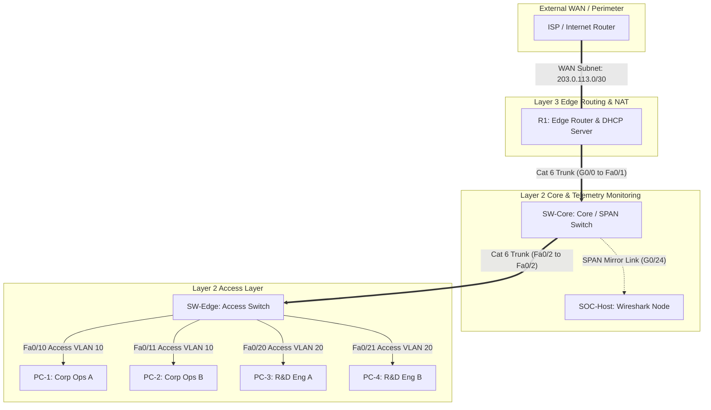

# Multi-VLAN Dual-Stack Enterprise Backbone with SecOps SPAN Telemetry

## Project Portfolio Overview

This repository archives the architectural design, implementation blueprints, and telemetry data for a production-grade, highly resilient branch infrastructure. Designed to mirror a real-world enterprise branch expansion, this project transitions a network from an initial virtualized proof-of-concept (Cisco Packet Tracer) to physical corporate hardware.

### High-Value Architectural Features
* **Scalable Micro-Segmentation:** Separation of Corporate Operations and R&D Engineering traffic using 802.1Q VLAN encapsulation across multiple concurrent endpoints per subnet.
* **Dual-Stack & Automated Addressing:** Concurrent data planes running parallel IPv4 (via dynamic DHCP pools) and IPv6 Global Unicast Addresses (SLAAC) paired with standardized Link-Local address maps.
* **SecOps Telemetry (SPAN Parsing):** Deployment of an active Switched Port Analyzer session to mirror all ingress and egress branch traffic to a dedicated Network Security Operations host for deep packet evaluation.
* **Access Layer Hardening:** Implementation of multi-layer security mechanisms, including active Port Security constraints (MAC address locking) and the systematic mitigation of Native VLAN hopping attacks.
* **Edge WAN Integration:** Scaled edge perimeter simulation connecting the branch internal multi-VLAN matrix to a simulated ISP using Dynamic PAT (NAT Overload) and static default routes.

---

## Logical Architecture & Network Topology



---

## Enterprise Addressing & Subnet Map

| Device / Link Domain | Role / Sub-Interface Description | IPv4 Subnet / Interface IP | IPv6 Global Unicast Address (GUA) | IPv6 Link-Local Address |
| --- | --- | --- | --- | --- |
| **VLAN 10** | Corporate Operations | `192.168.10.0/24` | `2001:db8:acad:10::/64` | `fe80::1` (R1 Gateway) |
| **VLAN 20** | R&D Engineering | `192.168.20.0/24` | `2001:db8:acad:20::/64` | `fe80::1` (R1 Gateway) |
| **VLAN 99** | Native Trunk & Management | `192.168.99.0/24` | `2001:db8:acad:99::/64` | `fe80::1` (R1 Gateway) |
| **WAN Link** | External Internet Perimeter | `203.0.113.0/30` | — | — |
| **R1 G0/0.10** | Sub-Interface Gateway (VLAN 10) | `192.168.10.1` | `2001:db8:acad:10::1/64` | `fe80::1` |
| **R1 G0/0.20** | Sub-Interface Gateway (VLAN 20) | `192.168.20.1` | `2001:db8:acad:20::1/64` | `fe80::1` |
| **R1 G0/0.99** | Sub-Interface Gateway (VLAN 99) | `192.168.99.1` | `2001:db8:acad:99::1/64` | `fe80::1` |
| **R1 G0/1** | Outbound WAN Edge Interface | `203.0.113.2` | — | — |
| **SW-Core** | Management SVI | `192.168.99.10` | `2001:db8:acad:99::10/64` | `fe80::10` |
| **SW-Edge** | Management SVI | `192.168.99.20` | `2001:db8:acad:99::20/64` | `fe80::20` |

---

## Infrastructure Hardening Blueprint (Sanitized)

The complete production-ready configurations are maintained inside the [`/configs`](https://www.google.com/search?q=./configs) directory. Key hardening structures implemented across the baseline include:

### 1. Dynamic IPv4 Allocation & Port Security (SW-Edge Configuration)

Access interfaces are locked down to mitigate rogue device attachment and DHCP spoofing vectors:

```ios
interface range FastEthernet0/10 - 11
 switchport mode access
 switchport access vlan 10
 switchport port-security
 switchport port-security maximum 1
 switchport port-security violation shutdown
 no shutdown
!
interface range FastEthernet0/3 - 9, FastEthernet0/12 - 19, FastEthernet0/22 - 24
 shutdown
```

### 2. Edge WAN Routing & Dynamic NAT/PAT (R1 Configuration)

Internal subnets are mapped through a network address translation ACL matching internal domains to the public outbound WAN interface:

```ios
ip nat inside source list 1 interface GigabitEthernet0/1 overload
access-list 1 permit 192.168.0.0 0.0.255.255
!
ip route 0.0.0.0 0.0.0.0 203.0.113.1
!
ip dhcp pool VLAN10_POOL
 network 192.168.10.0 255.255.255.0
 default-router 192.168.10.1
!
ip dhcp pool VLAN20_POOL
 network 192.168.20.0 255.255.255.0
 default-router 192.168.20.1
```

---

## Physical Lab Deployment & Architectural Hurdles

Transitioning this blueprint to physical hardware (Cisco Catalyst 3560-X Distribution Switches and ISR 4321 Routers) exposed two critical real-world operational challenges:

### 1. The Catalyst ASIC Memory Constraint (SDM Template Deficit)

By default, standard legacy Catalyst desktop switches are equipped with an application-specific integrated circuit (ASIC) memory allocation profile that optimizes exclusively for IPv4 unicast routing. Attempting to assign an IPv6 address to the Management SVI fails silently or throws an syntax/allocation error on the terminal console.

* **The Engineering Fix:** Prior to building out the dual-stack topology, the hardware Switch Database Manager (SDM) template was re-allocated and synchronized across both switches:
```ios
SW-Core(config)# sdm prefer dual-ipv4-and-ipv6 default
SW-Core# reload
```


### 2. IPv6 Control Plane Multicast Convergence Issues

During initial staging, endpoints within a single VLAN successfully negotiated IPv4 parameters via broadcast DHCP, but structural IPv6 SLAAC address assignment failed due to Packet Tracer simulator control plane boundaries.

* **The Engineering Fix:** Manually verified via the router CLI that Router Advertisements were unsuppressed (`no ipv6 nd ra-suppress`) and verified convergence by confirming that both link-local and global unicast endpoints populated the central hardware routing engine's neighbor database:
```ios
R1# show ipv6 neighbors
```


---

## SecOps Telemetry & Traffic Analysis

To establish permanent passive monitoring without injecting latency or modification onto active data plane streams, a Switched Port Analyzer (SPAN) monitor session was deployed on `SW-Core`. It replicates all bidirectional traffic traversing the edge uplink (`Fa0/1`) and sends a duplicate copy directly out of `G0/24` to a dedicated analysis host running an Ethernet interface in **Promiscuous Mode**.

### Artifact 1: SPAN Verification (Switch Diagnostics)

Running diagnostics verifies that the monitoring session is active and routing duplicated data packets to our hardware telemetry console:

```text
SW-Core# show monitor session 1
Session 1
---------
Type                   : Local Session
Source Ports           :
    Both               : Fa0/1
Destination Ports      : Gi0/24
    Encapsulation      : Native
          Ingress      : Disabled
```

*Artifact Reference:* ``

### Artifact 2: Cryptographic Management Validation (SSHv2 Handshake Intercept)

A deep packet scan of the capture file `span-capture.pcap` isolates the secure SSH administrative session traversing the network. This confirms that all command-and-control access points across the corporate footprint are encrypted:

```text
Frame 402: 154 bytes on wire (1232 bits), 154 bytes captured on interface 0
Transmission Control Protocol, Src Port: 53211, Dst Port: 22, Seq: 1, Ack: 1
SSH Protocol
    SSH Version 2 (encryption active)
    Key Exchange Init Packet (Encapsulated)
```

*Artifact Reference:* ``

### Artifact 3: IPv6 Control Plane Resolution (ICMPv6 Discovery)

Filtering the telemetry file for `icmpv6` isolates Neighbor Solicitation and Router Advertisement packets, confirming that the stateless automatic configuration engine is active across all subnets.
*Artifact Reference:* ``

---

## Verification Logs & Hardware Proofs

All hardware diagnostic logs, topology maps, and raw network capture traces are safely committed within the project structure:

* **Raw IOS Configuration Node Prints:** Located in [`/configs/`](https://www.google.com/search?q=./configs).
* **Raw Telemetry Packet Capture Files:** Located in [`/telemetry/span-capture.pcap`](https://www.google.com/search?q=./telemetry).

---

## License

This architecture documentation archive is released under the terms of the MIT Open Source License.
